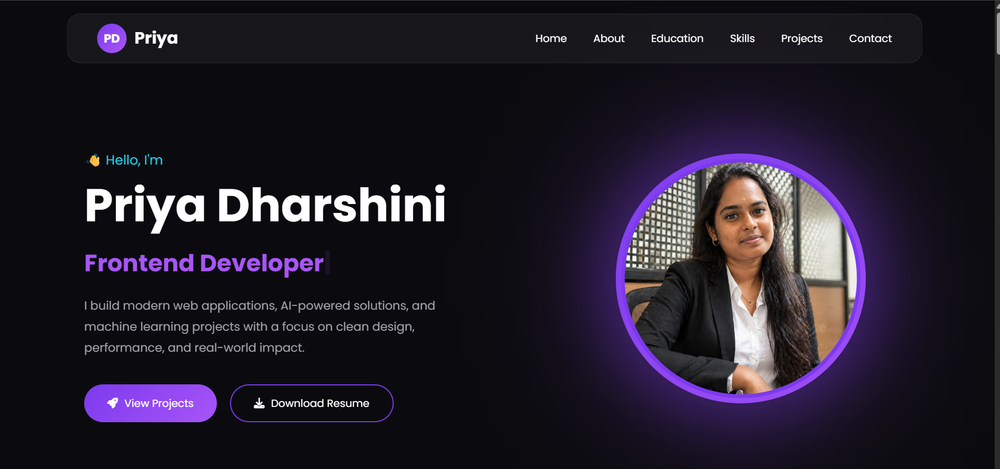
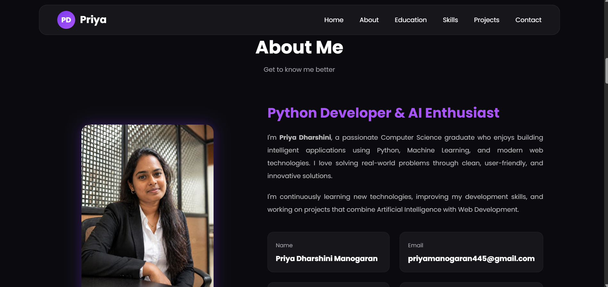
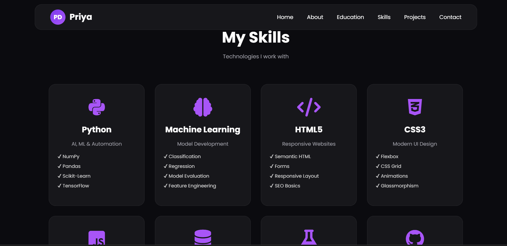
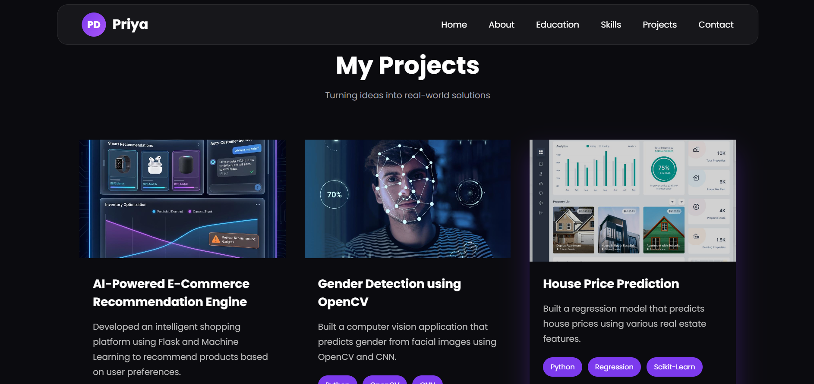
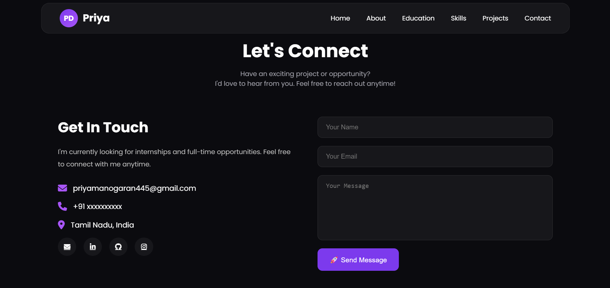

# 🌐 Priya Dharshini - Portfolio

Welcome to my personal portfolio website! This portfolio showcases my skills, projects, and journey as a Python Developer and AI & Machine Learning Enthusiast.

---

## 🚀 Live Demo

🔗 Coming Soon (Netlify)

---

## ✨ Features

- 🎨 Modern and Responsive UI
- 🌙 Dark Theme Design
- 📱 Mobile-Friendly Layout
- 📧 Contact Form with EmailJS
- ⚡ Smooth Animations (AOS)
- ⌨️ Typing Animation
- 📂 Projects Showcase
- 💼 Education & Experience Timeline
- 🛠️ Skills Section
- 🔗 Social Media Links

---

## 🛠️ Technologies Used

- HTML5
- CSS3
- JavaScript
- EmailJS
- AOS (Animate On Scroll)
- Font Awesome

---

## 📂 Project Structure

```
portfolio/
│── assets/
│── images/
│── index.html
│── style.css
│── script.js
│── README.md
```

---

## 📸 Screenshots

## 📸 Home



## 👩 About



## 🛠 Skills



## 💻 Projects



## 📞 Contact



---

## 🎯 Future Improvements

- GitHub API Integration
- Dark/Light Mode Toggle
- Project Filtering
- Blog Section
- Download Resume Feature

---

## 👩‍💻 Author

**Priya Dharshini**

- 💼 LinkedIn: https://www.linkedin.com/in/priya-manogaran-6b9a7b351
- 💻 GitHub: https://github.com/priyamanogaran-codes
- 📧 Email: priyamanogaran445@gmail.com

---

⭐ If you like this project, consider giving it a Star!
